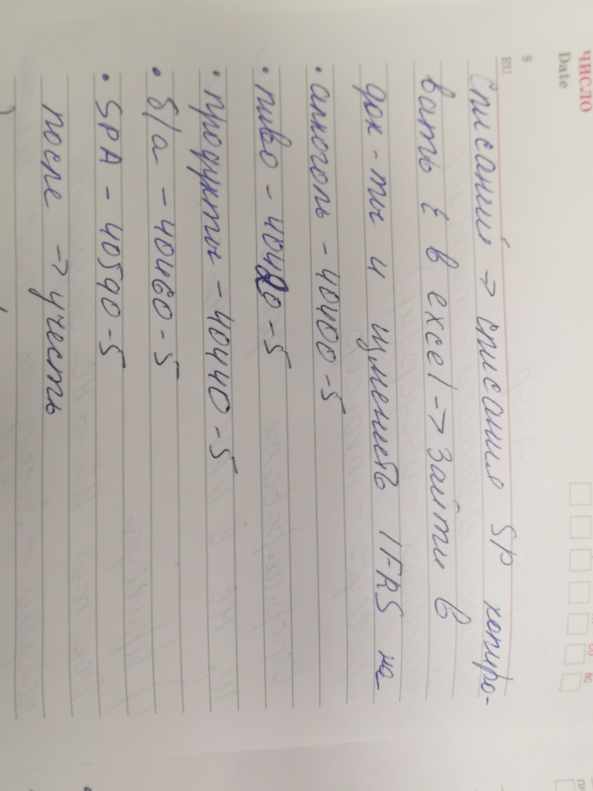

# Заголовок 1
## Заголовок 2
### Заголовок 3
#### Заголовок 4

Заголовок 1
=
Заголовок 2
-
* пункт списка
- пункт списка
+ пункт списка
___
1. пункт списка
2. пункт списка
3. пункт списка

1. пункт списка
    * пункт списка
    - пункт списка
    + пункт списка

***
*Краткое описание: Генеральная карта провинции Ингерманландии, которая показывает всю ее ситуацию,* 
 расположение всех церквей, усадеб, селений, болот, протяжение больших и малых дорог, а также озер, малых рек и ручьев, скопированной Его королевского величества Главным землемерным управлением в 1704 г., **из Нарвы в 1703** году пересланная с замечанием Эриком Белингом о том, что согласно работе 1678 г. и при более поздних измерениях северная часть Нотебoргского лена была обновлена.

`
 $a = 5;
 $b = 3;
 $c = $a + $b;
 `
 >ского лена была обновлена

 [Текст](https://)

 

 Item     | Value     | Quantity
:-------- | :--------:| ---------:
Computer  | 1600      | 3   
Phone     | 12        | 2
Pipe      | 1         | 1  